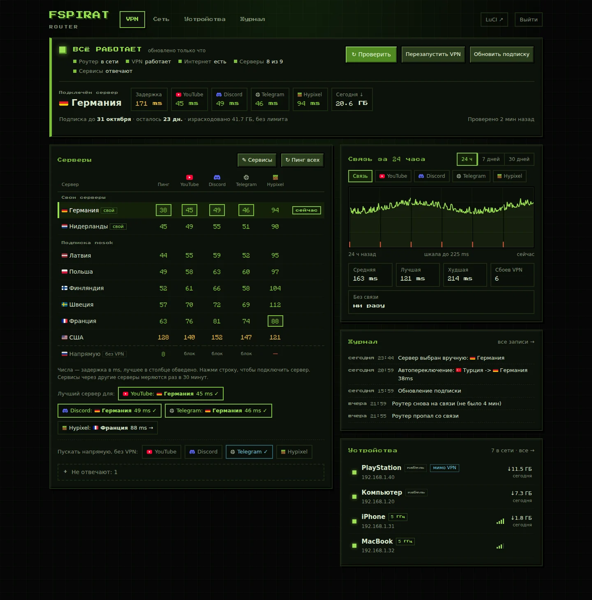
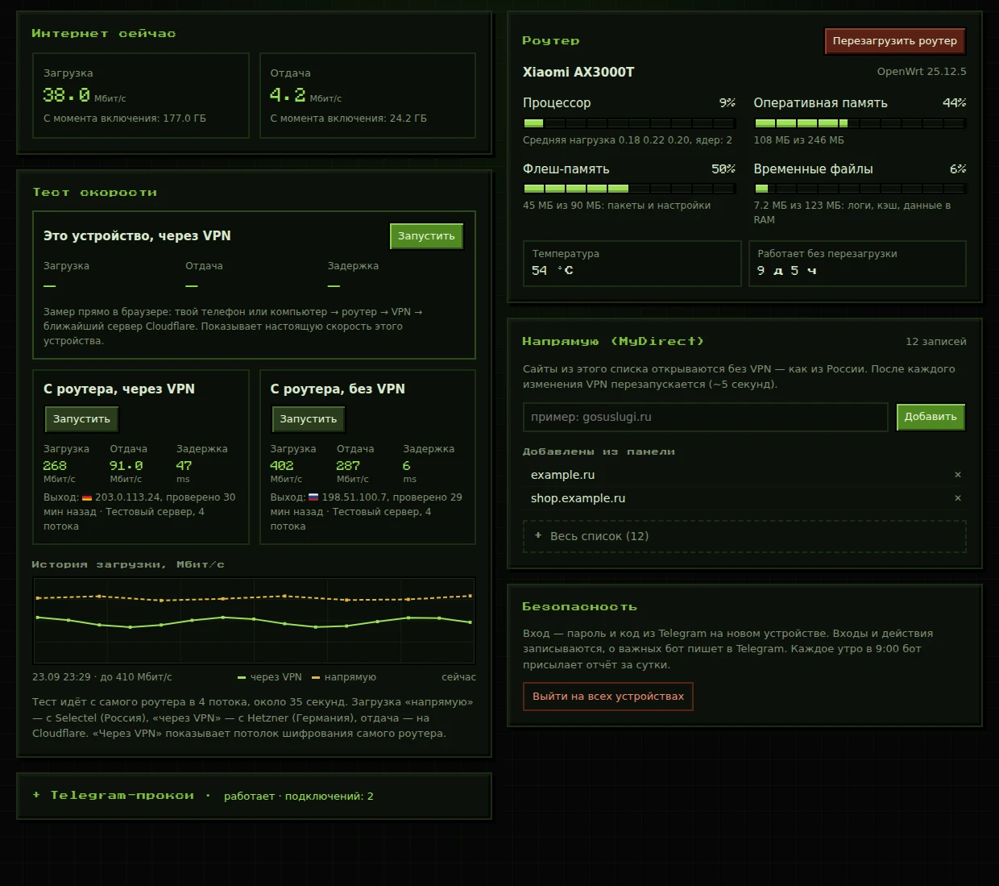
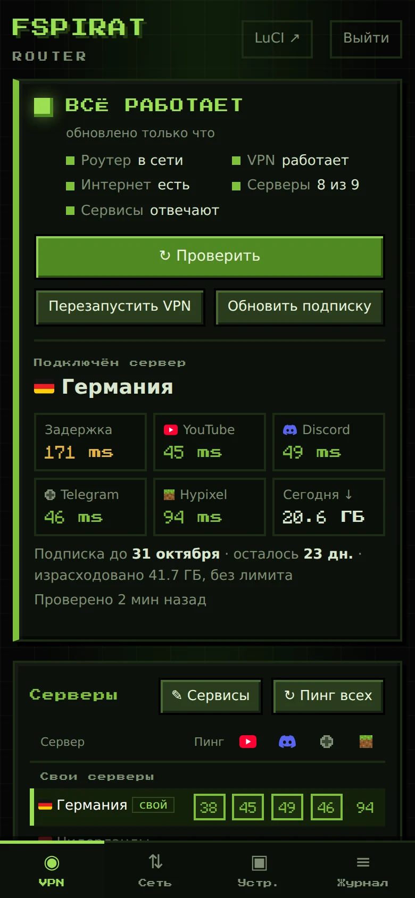
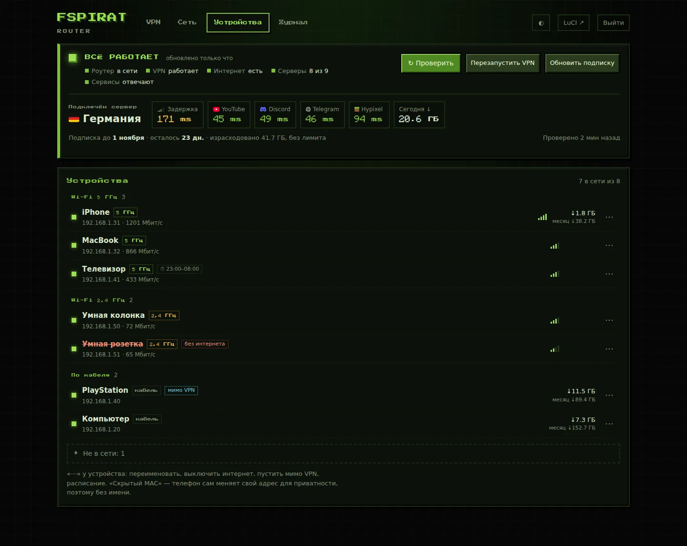

# 🛰️ FSPIRAT Router — домашний роутер с VPN, веб-панелью и Telegram-ботом


Скрипты и конфигурация домашнего роутера на OpenWrt с VPN через PassWall 2 и панель управления к нему. Панель открывается из браузера через VPS, уведомления и управление идут через Telegram-бота.

Российские сайты и всё, что попало в список **MyDirect**, открывается напрямую. Остальной трафик идёт через VPN: сервер подписки или свои серверы в Германии и Нидерландах. Если текущий сервер перестал работать, роутер сам переключается на лучший.

По желанию (переключатели в панели) YouTube и Discord идут напрямую через провайдера с обходом DPI (**zapret**), а Telegram на всех устройствах дома — через Cloudflare мимо VPN (**tg-ws-proxy**), без настройки на устройствах.

> [!NOTE]
> Это личная инфраструктура под конкретную связку: Xiaomi AX3000T, OpenWrt 25.12, PassWall 2 и VPS на Ubuntu 24.04. В скриптах зашиты адреса, имена узлов PassWall и пути, поэтому для другой сети их придётся править. Универсального установщика нет.

<p align="center">
  
  <br><sub>Вкладка «VPN». Здесь и ниже скриншоты сделаны на демо-данных: устройства, адреса и цифры выдуманы.</sub>
</p>

## Как это устроено

```text
 устройства дома ──► роутер OpenWrt + PassWall 2 ──► VPN-сервер ──► интернет
                       │   (MyDirect и .ru — напрямую)
                       │ обратный SSH-туннель
                       ▼
 браузер ──HTTPS──► VPS: nginx + PHP (вход, история, журнал) ──► Telegram-бот
```

| Часть | Папка | Что делает |
|---|---|---|
| Роутер | `router/` | пинг и проверка серверов, автопереключение, CGI-API для панели, учёт трафика и блокировки устройств, туннель до сервера |
| Сервер | `server/` | страница входа, история и журнал, наблюдатель с уведомлениями, Telegram-бот, nginx, fail2ban, Telegram-прокси |
| Панель | `web/` | веб-страница управления (HTML/CSS/JS без фреймворков и внешних CDN) |
| Свои VPN | `server/vpn-nl/`, `vds2/` | Xray VLESS + Reality на серверах в Нидерландах и Германии |

## Возможности

### 🖥️ Веб-панель

- ✅ Общий статус: роутер, VPN, интернет, серверы и сервисы. Видны дата окончания подписки и её расход
- ✅ Таблица серверов с пингом и задержкой до YouTube, Discord, Minecraft-серверов и других сервисов через **каждый** сервер; подключение нажатием на строку
- ✅ Режим «Напрямую (без VPN)» как отдельный «сервер»: весь трафик с IP провайдера, правила MyDirect и zapret продолжают работать
- ✅ Подсказка «лучший сервер для сервиса»; список сервисов для замера правится прямо из панели
- ✅ График связи за 24 часа, 7 и 30 дней (средняя, лучшая, худшая задержка, сбои, время без связи), журнал событий с фильтрами
- ✅ Блок **Zapret**: включение, выбор стратегии, проверка YouTube и Discord с роутера, переключатель **Telegram** (tg-ws-proxy)
- ✅ Тест скорости из браузера (через Cloudflare) и с самого роутера, через VPN и напрямую, с историей
- ✅ Ресурсы роутера: процессор, память, флеш, температура и время работы; перезапуск VPN и перезагрузка роутера
- ✅ MyDirect: добавление и удаление сайтов, которые открываются без VPN, и переключатель «пускать сервис напрямую»
- ✅ Устройства: диапазон Wi-Fi, сигнал, трафик за день и месяц. Устройство можно переименовать, выключить ему интернет, пустить мимо VPN или задать расписание
- ✅ Вход по паролю с кодом из Telegram на новом устройстве, кнопка «выйти на всех устройствах»
- ✅ Мобильная версия с нижней навигацией, установка как приложение (PWA)

### 📡 Роутер

- ✅ `fspirat-ping` раз в 5 минут: TCP-пинг всех серверов и проверка текущего настоящим запросом через SOCKS PassWall
- ✅ После 2 неудачных проверок подряд роутер сам переключается на сервер с лучшим пингом
- ✅ `fspirat-svcping` раз в 30 минут меряет сервисы через каждый живой сервер: поднимает временный Xray, по одному серверу за раз
- ✅ `fspirat-fw`: своя таблица nftables для счётчиков трафика, блокировки по MAC и расписания (проверка раз в минуту)
- ✅ `fspirat-sub` раз в час читает из заголовков подписки расход и дату окончания
- ✅ `fstunnel`: обратный SSH-туннель до сервера, по нему работают панель, LuCI и выкладка на роутер
- ✅ `fspirat-zapret`: YouTube и Discord напрямую с обработкой nfqws (zapret v72), стратегия по умолчанию 3; своя таблица nftables, VPN-трафик не затрагивается, при сбое движка — возврат в VPN
- ✅ `fspirat-tgws`: tg-ws-proxy (Flowseal) на Python; своя таблица nftables перехватывает Telegram устройств дома и отправляет его через Cloudflare (прямые адреса Telegram провайдер блокирует). Сторож раз в минуту снимает перехват, если прокси не отвечает — тогда Telegram снова идёт через VPN

### 🔔 Сервер и Telegram

Наблюдатель `fspirat-watch` запускается раз в минуту и пишет в Telegram, если:

- роутер не на связи 3 минуты и когда он вернулся;
- VPN остановлен или снова работает;
- сервер сменился вручную или автоматически;
- в сети появилось новое устройство;
- кто-то вошёл в панель или подбирает к ней пароль;
- флеш роутера заполнен на 90%;
- до окончания подписки или SSL-сертификата осталось мало дней.

Каждое утро он присылает отчёт за сутки.

Бот принимает команды только из чата владельца. Опасные действия он выполняет после кнопки подтверждения.

| Команда | Что делает |
|---|---|
| `/status` | состояние VPN, сервера и сервисов |
| `/servers`, `/vpn германия` | серверы с пингом и подключение к серверу |
| `/devices`, `/block имя`, `/unblock имя` | устройства в сети и управление их интернетом |
| `/speed`, `/ping` | тест скорости без VPN и перемер серверов |
| `/router`, `/vds` | нагрузка роутера и состояние своих серверов |
| `/log`, `/report` | журнал событий и отчёт за сутки |
| `/update`, `/restart`, `/reboot` | обновить подписку, перезапустить VPN, перезагрузить роутер |
| `/tgproxy`, `/help` | Telegram-прокси и список команд |

Дополнительно на сервере:

- **Telegram-прокси** (mtg) на 443-м порту, общий с сайтами через разбор SNI в nginx stream (`server/mtproxy/`).
- **Свои VPN-серверы** — Xray VLESS + Reality в режиме «сам у себя»: соединение маскируется под собственный сайт сервера с настоящим сертификатом.

## Скриншоты

<p align="center">
  
  
  <br><sub>Вкладка «Сеть»: тест скорости, ресурсы роутера, MyDirect · мобильная версия</sub>
</p>
<p align="center">
  
  <br><sub>Вкладка «Устройства»: диапазон Wi-Fi, трафик, блокировка, расписание, «мимо VPN»</sub>
</p>

## Требования

| Где | Что нужно |
|---|---|
| Роутер | OpenWrt (проверено на 25.12.5, Xiaomi AX3000T), PassWall 2 с Xray, `tcping`, `curl`, `lua`, nftables (fw4), dropbear `dbclient`; для zapret — `kmod-nft-queue`, для tg-ws-proxy — `python3-light` (~13 МБ флеша; ставят workflow) |
| Сервер | Ubuntu 24.04, nginx с модулем stream, PHP 8.1+ (php-fpm), bash, `curl`, `jq`, cron, fail2ban, certbot |
| Прочее | домен с DNS-записями на сервер, бот Telegram (токен от @BotFather), подписка VPN для PassWall |

## Выкладка

Изменения выкладываются через GitHub Actions. Ключи и адреса берутся из секретов репозитория и в коде не хранятся.

| Workflow | Когда | Что делает |
|---|---|---|
| **Deploy router page** | автоматически при пуше в `web/` | rsync страницы на сервер |
| **Deploy router** | вручную | скрипты на роутер через сервер и туннель; cron-задачи добавляет, если их нет |
| **Deploy server** | вручную | страница входа, бот, наблюдатель, fail2ban, logrotate, настройки nginx |
| **MTProxy setup** | вручную | установка Telegram-прокси с копией nginx и откатом при ошибке |
| **VDS2 Germany** | вручную | первичная настройка VPN-сервера в Германии, вход только по ключу, Reality «сам у себя» |
| **Rotate router token** | вручную | новый токен CGI на роутере и сервере |
| **Router backup** | вручную | архив конфигураций роутера и файлов панели с датой (на роутере и на сервере), `RESTORE.txt` внутри |
| **Zapret install** | вручную | движок zapret (nfqws) для YouTube/Discord; требует свежую копию, режим оставляет выключенным |
| **TG WS Proxy install** | вручную | tg-ws-proxy (Python) для Telegram через Cloudflare; требует свежую копию, режим оставляет выключенным |
| **SSH hardening**, **Restrict deploy key** | вручную | вход на сервер только по ключу; ключ выкладки — только rsync в папку сайта |
| **Server ops** | вручную | выполнить служебную команду на сервере и показать вывод |

Из дома, без Actions:

```bash
bash scripts/deploy-router.sh   # скрипты на роутер (компьютер в домашней сети)
bash scripts/deploy-server.sh   # серверная часть
bash scripts/check.sh           # быстрая проверка, что всё живо
```

## Конфигурация

Настоящие значения лежат только на устройствах. В репозитории есть примеры `*.example`, а `.gitignore` не пускает в git токены, ключи и `.env`.

| Файл | Где | Что внутри |
|---|---|---|
| `/etc/fspirat-watch.conf` | сервер | `TG_TOKEN` и `TG_CHAT` бота (пример — `server/fspirat-watch.conf.example`) |
| `/etc/fspirat.token` | роутер и nginx на сервере | токен, с которым сервер обращается к CGI роутера |
| `/etc/fspirat/targets` | роутер | сервисы для замера: строки `вид\|имя\|адрес`, правятся из панели |
| `/etc/fspirat/blocked`, `/etc/fspirat/schedule` | роутер | устройства без интернета и расписания |
| `router/passwall/*.txt` | репозиторий | списки доменов для правил PassWall (MyDirect, AI) |

## Известные ограничения

- Узлы Hysteria2 не работают: PassWall стоит без sing-box.
- Данные роутера в `/tmp/fspirat` стираются при перезагрузке. История связи и журнал хранятся на сервере.
- Тест скорости «с роутера через VPN» упирается в скорость шифрования самого роутера. Скорость конкретного устройства показывает тест из браузера.
- Пока туннель до роутера не работает, команды до роутера не доходят; панель показывает только историю, сохранённую на сервере.
- Zapret: голос Discord (UDP на IP без имени) остаётся через VPN, если не выбран режим «Напрямую»; стратегия обхода зависит от провайдера.
- Telegram через tg-ws-proxy: новое соединение открывается примерно на 0,2 с дольше, чем через VPN (путь через Cloudflare); звонки и веб-версия Telegram идут через VPN.

## Документация

- [`docs/infrastructure.md`](docs/infrastructure.md) — домены, сервер, роутер, PassWall и восстановление с нуля
- [`docs/history.md`](docs/history.md) — какие проблемы решались и почему сделано именно так
- [`docs/zapret.md`](docs/zapret.md) — YouTube и Discord через zapret: путь пакета, списки, ограничения, откат
- [`docs/tgws.md`](docs/tgws.md) — Telegram через tg-ws-proxy на роутере
- [`docs/audit-2026-10.md`](docs/audit-2026-10.md) — аудит безопасности и интерфейса
- [`web/fonts/README.md`](web/fonts/README.md) — шрифты панели и их лицензии

## Лицензия

Лицензия для кода не указана, файла `LICENSE` нет. Шрифты в `web/fonts/` распространяются под своими лицензиями: SIL OFL 1.1, MIT и CC-BY 4.0.
